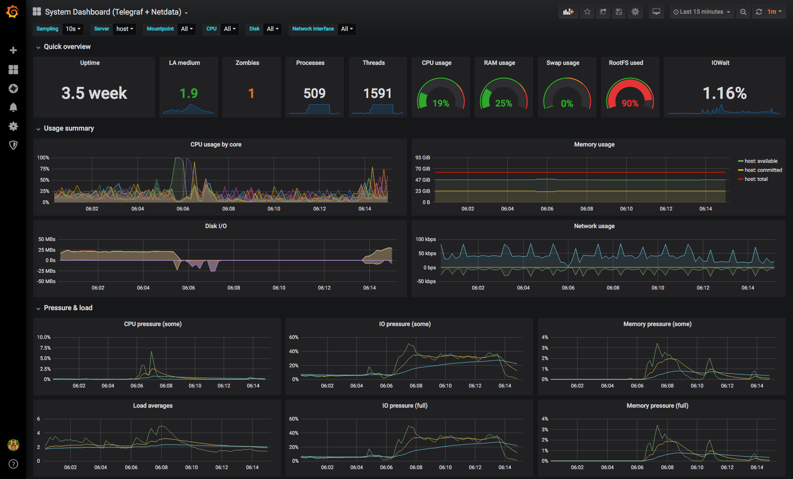

# Grafana Dashboards

## System Dashboard: Telegraf + Netdata



Based on <https://grafana.com/grafana/dashboards/928>, with tweaks.

The first page is a condensed system summary, including:
* CPU usage by core in single graph
* Memory usage (using the `Committed_AS` and `Available` values, which are more useful for overviews)
* Disk I/O for all disks in a single graph
* Network usage
* Linux Pressure Stall Information (PSI), collected by Netdata

Tweaks to the original dashboard:
* Display gaps for missing data in graphs: <https://github.com/influxdata/influxdb/issues/7185#issuecomment-349024751>
* Use `$__interval` instead of the deprecated `$interval`
* Avoid `NON_NEGATIVE_DERIVATIVE()` where not needed
* Singlestat panels that show guages are migrated to Guage panels

The influxdb datasource variables `$telegraf` and `$netdata` are hidden by default. To change them after importing the dashboard, open the dashboard settings, go to the variables section, click on the variable, change the "hide" selection box to the empty value, and click update. When you return to the dashboard, the variable will be modifiable at the top of the dashboard next to the other variables.

### `/etc/telegraf/telegraf.conf` configuration

Update the default telegraf.conf file to uncomment the following collector sections and properties

```toml
[agent]
  # Update the Grafana internal metrics query interval to match the interval value
  interval = "10s"
[[outputs.influxdb]]
  # Configure to connect to influxdb
[[inputs.cpu]]
  percpu = true
  totalcpu = true
  collect_cpu_time = false # Optional
  report_active = false
[[inputs.disk]]
  ignore_fs = ["tmpfs", "devtmpfs", "devfs", "iso9660", "overlay", "aufs", "squashfs"]
[[inputs.diskio]]
  skip_serial_number = false # Optional
[[inputs.kernel]]
  # no configuration
[[inputs.mem]]
  # no configuration
[[inputs.processes]]
  # no configuration
[[inputs.swap]]
  # no configuration
[[inputs.system]]
  # no configuration
[[inputs.conntrack]]
  # default configuration
[[inputs.docker]]
  # default configuration
[[inputs.internal]]
  # default configuration
[[inputs.interrupts]]
  cpu_as_tag = true # Optional
[[inputs.kernel_vmstat]]
  # no configuration
[[inputs.linux_sysctl_fs]]
  # no configuration
[[inputs.net]]
  # default configuration
[[inputs.netstat]]
  # no configuration
[[inputs.nstat]]
  # default configuration
[[inputs.systemd_units]]
  # default configuration
```

### `/etc/influxdb/influxdb.conf` configuration

Update the default influxdb.conf file to uncomment the opentsdb section and configure its properties

```toml
[[opentsdb]]
  enabled = true
  bind-address = "localhost:4242"
  database = "opentsdb"
```

### `/etc/netdata/netdata.conf` configuration

Add and configure the backend section to the default netdata.conf file to write to influxdb

```ini
[backend]
    enabled = yes
    type = opentsdb
    destination = localhost:4242
```
